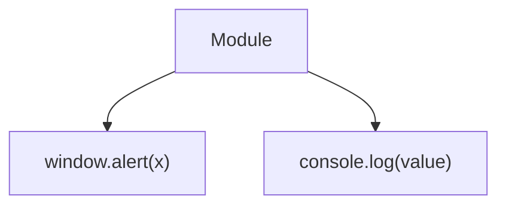
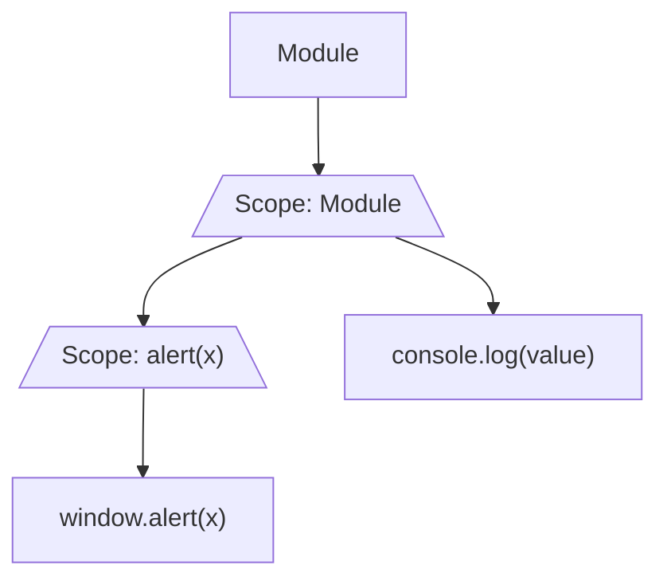

# Reactive Script Notes

# Parsing

## 1. Build reactive graph

We need to build a graph of all the reactive statements.

e.g.

```js
function alert(x) {
  $: window.alert(x);
}

let value = 10;

$: console.log(value);

value = 20;
```

has a reactive graph of



Before we do the transform we want to understand the inputs and outputs of each scope so we now how to inject reactivity.



### Thoughts

- We should be able to remove dead branches (ones without reactivity) in first pass
